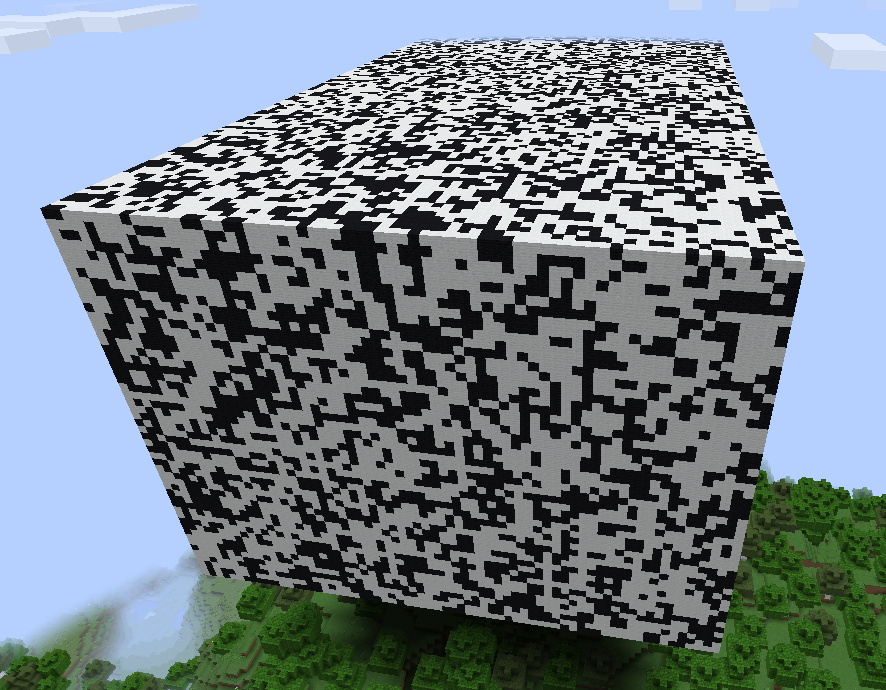
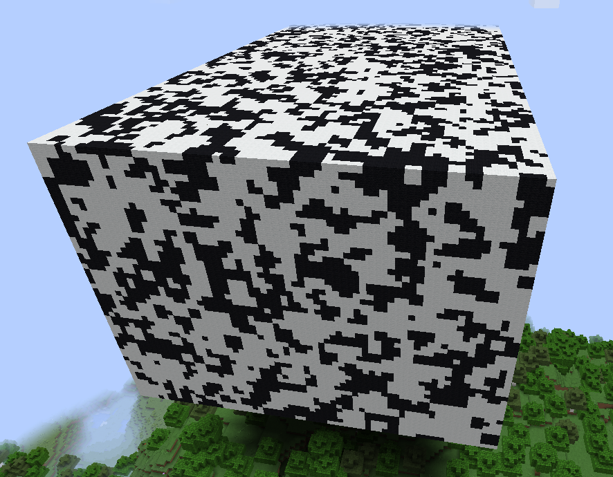
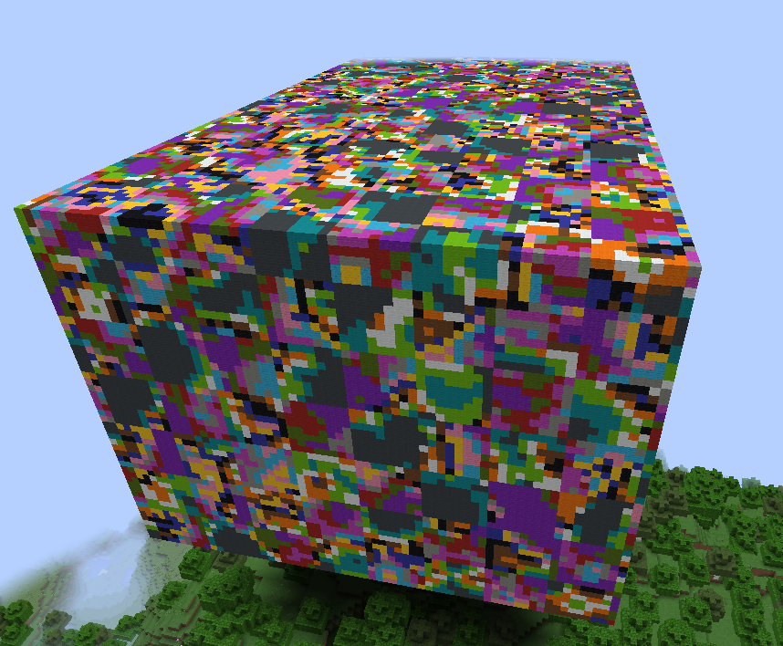

# NoisyPatterns

This tool extends [FastAsyncWorldEdit](https://modrinth.com/plugin/fastasyncworldedit) with new patterns.
They can be used in commands like `//set` or anything else where patterns are accepted.

The actual functionality is based on [jlibnoise](https://github.com/EngineHub/jlibnoise).
This library provides different modules to build custom noise functions from.
Some of them are already exposed in WorldEdit (in expressions) and FastAsyncWorldEdit (e.g. the `#perlin` pattern).

This extension takes it to a next step: It lets you freely combine the modules in the way you want!

## Usage

This section will use the `//set` command as an example, but it equally works for other commands and brushes.

The main structure of a noise pattern is `#noise[<module configuration>][<blocks to use>][<optional scale parameter>]`.
A very simple command can look like this: `//set #noise[voronoi][black_wool,white_wool]`

With additional scaling, e.g. `//set #noise[voronoi][black_wool,white_wool][2]`, the result will look different:

Modules allow for more configuration. 
The specific parameters can be found [in the libnoise documentation](https://libnoise.sourceforge.net/docs/classnoise_1_1module_1_1Module.html).
As an example, the voronoi module has an `EnableDistance` function,
which we can use in NoisyPatterns like that: `voronoi[enableDistance=true]`.
As a full command, this could look like `//set #noise[voronoi[enableDistance=true]][##wool][8]` and result in

Some modules also take other modules as input. In such case, the inner modules are numbered from 0 to (n - 1),
where n is the number of expected modules. 
For example, `blend` takes 3 modules to generate noise from, so you need to specify modules 0, 1, and 2.
Example for `//set #noise[blend[0=voronoi[enableDistance=true],1=checkerboard,2=perlin]][##wool][8]`:
